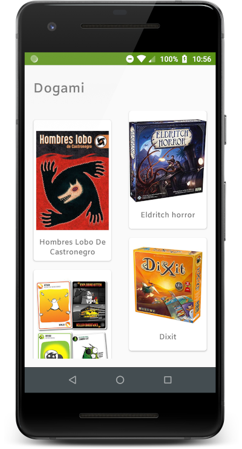
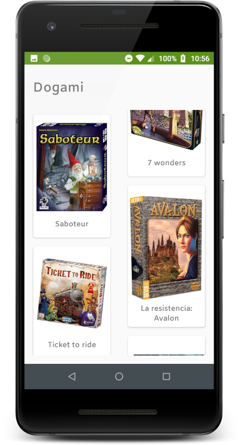
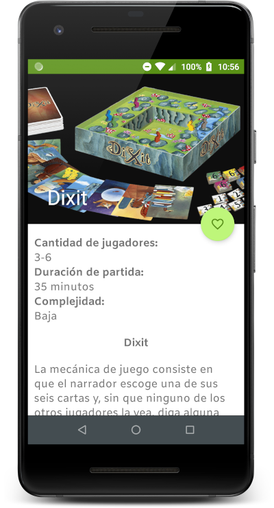
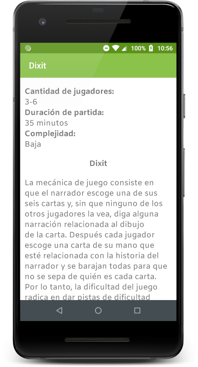

Dogami
======

Are you a board game lover?

### About the project:

This is a small app that displays a list of games, by clicking an item you can see a detail that contains:
- Players number.
- Game complexity.
- Game time.
- Game description.
- Also, you can mark a game as a favorite.
 
In summary, this is a wiki for board games!  

### About its architecture 

- The app has two screens and uses a personal API that has board games info.
- The first screen loads a list of games and displays them in a GridLayout.
- The second screen shows a game detail where you can mark a game as a favorite.
- The game list is being loaded, depending on the user location.
- This app is implementing the MVVM presentation pattern with data-binding.
- The dependency injection is using Dagger2.
- Tests are also using Dagger2.

### App screens

